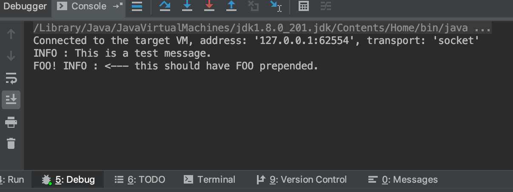

# Java Factory Provider

An implementation of the factory provider pattern, allowing users to consume objects based on interfaces rather than implementation.

This project serves as an example of how to:

* Inheritance
* Reflection
* Logging based on levels
* Consume objects in other projects without needing direct references

## Tools and Technologies

This project assumes that you are using:

* IntelliJ community
* Java 8
* Maven

## Running the Code

There are four separate projects:

* FactoryProvider.Core
	* Contains base factory provider code, as well as a basic logging service
* FactoryProvider.SampleLog
	* Trivial override of the basic logging service in the .Core project
* FactoryProvider.Module
	* Provides a factory provider module that will be registered in the example project, that tells the FactoryProvider to use the "SampleLog" logger instead of the default one
* FactoryProvider.Example
	* Provides a basic console application that demonstrates the two different loggers
 
## Sample Project

There's an "Example Project" configuration that can be ran/debugged within IntelliJ, and will display the following output:

* INFO : This is a test message.
* FOO! INFO : <--- this should have FOO prepended.

## Acknowledgements

* Readme borrowed from [PurpleBooth](https://gist.githubusercontent.com/PurpleBooth/109311bb0361f32d87a2/raw/8254b53ab8dcb18afc64287aaddd9e5b6059f880/README-Template.md)
